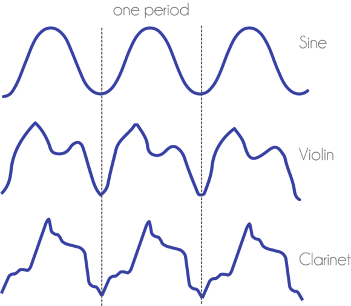
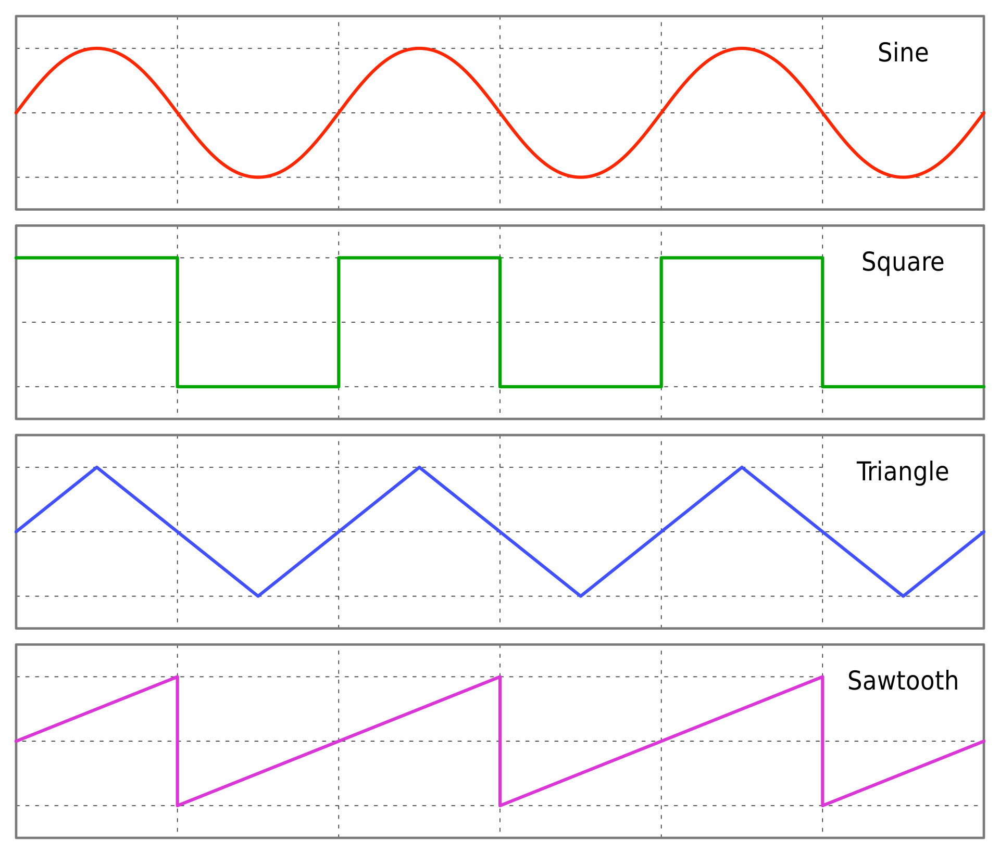

<h1 align=center>Music with Programming<h1>

<h2 align=center><em>By Prof. Sebastián Romero Cruz</em></h2>

### 7 Germinal Year CCXXXI

***Song of the day***: _[**Healing the Great Fairy**](https://youtu.be/FrPuWk24DT4) by Theophany (2016)._

### Sections

1. [**Introduction**](#introduction)
2. [**Playing Notes**](#part-1-playing-notes)
3. [**Playing Melodies**](#part-2-playing-melodies)
4. [**Music Synthesis**](#part-3-music-synthesis)
5. [**Looping (i.e. Playing Things More Than Once)**](#part-4-looping-ie-playing-things-more-than-once)
6. [**Samples**](#part-5-samples)
7. [**More Structures and a Sample Tune**](#part-6-more-structures-and-a-sample-tune)

### _Introduction_

Prior to studying computer science, I got my degree in chemical and biomolecular engineering. Now, I certainly don't mean to make this sound like I am ungrateful for the many things that I learned throughout those four years, but I certainly wasn't what you would call "happy". From the very beginning, I wanted to do things that were creative, but my perennial fear of not having a job got the better of me.

Enter computer science. To be honest, the whole reason why I got into this field in the first place was because I knew that not only was the job market a bit better around the New York area, but I was also aware of how many creative things you can accomplish with code. And one of the things that I recently found and have been trying to get into is composing with programming.

If anybody here is a musician and has used tools such as [**Logic**](https://en.wikipedia.org/wiki/Logic_Pro), [**Ableton**](https://en.wikipedia.org/wiki/Ableton_Live), [**Pro Tools**](https://en.wikipedia.org/wiki/Pro_Tools), or even [**Garage Band**](https://en.wikipedia.org/wiki/GarageBand), you will know how essential having access to any of these [**digital audio workstations**](https://en.wikipedia.org/wiki/Digital_audio_workstation) (or DAWs, for short) is to making music. And, at least to me, it seemed impossible to be able to recreate the powerful tools that these software offer through code.

Well, it turns out that not only can you make music through programming, but there's [**an**](https://youtu.be/YvsoWehBbec) [**entire**](https://youtu.be/zdc94RAX9UY) [**community**](https://youtu.be/oDHumac84aw) of [**musicians**](https://youtu.be/cydH_JAgSfg) that have replaced their entire workstation with just these programming tools.

So I'm gonna show you one of the most popular ones today: [***Sonic Pi***](https://sonic-pi.net/).

### Part 1: _Playing Notes_

Let's start with the basics: playing sounds. This is as easy as follows:

```rb
play :A6
```

This, quite simply, tells Sonic Pi to play an A-6 on a keyboard, using its default keyboard sound. You're not limited to musical notation either. You can also type the number of the note you want to play:

```rb
play 100
```

This means: "play the 100th note on the keyboard" (if it exists, of course). It's as easy and as "English-like as that". Personally, I prefer using the names of the notes, but Sonic Pi is super accessible even if you don't know squat about music theory. And that's a good thing. Software, regardless of what it does, should be [**accessible**](https://adevait.com/software/accessibility-in-software-development) to everybody.

Here's something interesting. What if we wanted to play a chord—i.e. multiple notes at once? In Sonic Pi, we can achieve this in the following way:

```rb
play :A5
play :D5
play :Bb4
play :G4
```

Very pretty and jazzy. Essentially, to play multiple notes **at once**, you write several `play`-statements one right after the other.

### Part 2: _Playing Melodies_

So that's one essential down—and a pretty big one too. For a lot of music styles, the ability to play a single chord is enough to produce an entire track. Personally, though, I find melody to be even more important than the ability to voice harmony. Those of you who may have programmed before will likely look at the code above and wonder why the notes played at the same time, and not one right after the other. This is a very procedural way of thinking, which means that we tend to think of our program's flow as executing from top to bottom, and not at the same time.

Sonic Pi is a little bit different in this regard. It turns out that, unless told otherwise, Sonic Pi will carry out your instructions **concurrently**—that is, at the same time. This is an important concept in computer science that you will learn a few ways down the line, but it essentially gives your computer the ability to, say, play music a the same time as you writing a paper. It doesn't stop one to let you do the other.

So, in other to play melodies, we need to tell Sonic Pi to wait for a specific period of time before performing the next step. Or, in common CS parlance, to **sleep**:

```rb
play :A5
sleep 1

play :D5
sleep 1

play :Bb4
sleep 1

play :G4
```

The number after the `sleep` keyword represents the length of the rest in our arpeggio. In this case, it waits `1` whole beat before playing the next note. You can, of course, change these numbers depending on the result that you're looking for:

```rb
play :A5
sleep 0.25

play :D5
sleep 0.25

play :Bb4
sleep 0.25

play :G4
```

That's four notes, played with a quarter rest after each other. Essentially: one measure. You can change the tempo of the track at the top of the file with the `use_bpm` keyword:

```rb
use_bpm 100

play :A5
sleep 0.25

play :D5
sleep 0.25

play :Bb4
sleep 0.25

play :G4
```

### Part 3: _Music Synthesis_

The sound that we've been hearing so far actually has a very specific name: the sine wave. If you have never had any experience with music synthesis, yes, that's the [**trigonometry sine wave**](https://en.wikipedia.org/wiki/Sine_wave):



<sub>**Figure 1**: The sine wave as seen through an oscilloscope, compared to the sound waves produced by a violin and a clarinet. [**source**](https://www.themusictelegraph.com/427) </sub>

Sonic Pi has a number of different instruments it calls synths (which is short for synthesisers). Whereas samples represent pre-recorded sounds, synths are capable of generating new sounds depending on how you control their wave form that you choose, and how you choose to manipulate it.

Let's try a very video-gamey one, the [**square wave**](https://en.wikipedia.org/wiki/Square_wave):

```rb
use_bpm 100
use_synth :square

play :A5
sleep 0.25

play :D5
sleep 0.25

play :Bb4
sleep 0.25

play :G4
```

Nice, right? In early video game music, sound chips were only capable of producing sounds using these very primordial waveforms.



<sub>**Figure 2**: Four of the most common waveforms. [**source**](https://en.wikipedia.org/wiki/Square_wave) </sub>

How did they make them sound so cool, then? They had several tricks, such as [**envelopes**](https://en.wikipedia.org/wiki/Envelope_(music)#ADSR) which, if I were to grossly oversimplify, change the duration of a note. This isn't a music synthesis class, so I won't get too much into it, but the Sonic Pi manual has a really nice [**explanation**](https://sonic-pi.net/tutorial.html#section-2-4) of how to play around with them. For now, I'll show you how using them changes the sound of the notes we currently have:

```rb
use_bpm 100
use_synth :square

play :A5
sleep 0.25

play :D5
sleep 0.25

play :Bb4
sleep 0.25

play :G4
sleep 0.50

# Hear the difference starting here?

play :A5, attack: 0.25, release: 0.75
sleep 0.25

play :D5, attack: 0.25, release: 0.75
sleep 0.25

play :Bb4, attack: 0.25, release: 0.75
sleep 0.25

play :G4, attack: 0.25, release: 0.75
```

Back in the [**Famicom**](https://en.wikipedia.org/wiki/Nintendo_Entertainment_System) days, these parameters (attack, release, etc.) were how engineers were able to make notes sound less dry, and more like an actual music track. Though, of course, they would have to do it by actually [**programming the chip manually**](https://youtu.be/m8z8-SKg3WU?t=325). sNot by writing one line of code. We live in a good time, in other words.

### Part 4: _Looping (i.e. playing things more than once)_

That's all very nice, but if we're going to be writing an entire 4-minute song, our program is going to end up having thousands of lines. I mean, the ones we wrote above are _just for one instrument_. We would need to factor in the drums, bass, and maybe a whole ensemble of other instruments. And if there is something to be said about programmers, it is that we by nature very lazy. Any form of repetition is basically anathema to our very existence.

Thankfully, most music is based around playing the same thing several times, with maybe a few changes here and there. Programming, too, happens to also be based on processes being executed several times, with maybe a few changes here and there. You may have heard of this term before, but to perform a series of steps several times in programming, we make use of what we call **loop**—i.e. structures that loop, or iterate.

In Sonic Pi, it's as easy as:

```rb
use_bpm 100
use_synth :square

4.times do
  play :A5, attack: 0.10, release: 0.50
  sleep 0.25
  
  play :D5, attack: 0.10, release: 0.50
  sleep 0.25
  
  play :Bb4, attack: 0.10, release: 0.50
  sleep 0.25
  
  play :G4, attack: 0.10, release: 0.50
  sleep 0.25  # note that I added this sleep command because it will loop back to the first note again
end
```

In English, you would read this as:

> For **4 times**, **do** the indented commands, and then **end**.

There are multiple kinds of loops in Sonic Pi, but one its most characteristic ones is the `live_loop` which, as the name implies, is meant to be played during live performances. All we need to do is replace the `4.times do` line with something like the following:

```rb
use_bpm 100
use_synth :square

live_loop :melody do
  play :A5, attack: 0.10, release: 0.50
  sleep 0.25
  
  play :D5, attack: 0.10, release: 0.50
  sleep 0.25
  
  play :Bb4, attack: 0.10, release: 0.50
  sleep 0.25
  
  play :G4, attack: 0.10, release: 0.50
  sleep 0.25  # note that I added this sleep command because it will loop back to the first note again
end
```

So what changed? In the first place, our `4` is gone. This means that this loop will continue running until we make a change to it. These changes include adding sounds to them, or deleting the loop completely.

The second change I implemented was giving the loop a **name**. In this case, I called it `:melody`, since that is pretty much what this is. This helps us keep track of what does what during our performance so that we can easily identify and change them on the fly.

### Part 5: _Samples_

With Sonic Pi, we're not limited to just synthetised sounds. In fact, we can also used recorded sounds in our code alongside anything that we generate. This is referred to as [**sampling**](https://en.wikipedia.org/wiki/Sampling_(music)).
For instance, let's a simple beat to our melody:


```rb
use_bpm 100
use_synth :square

live_loop :melody do
  play :A5, attack: 0.10, release: 0.50
  sleep 0.25
  
  play :D5, attack: 0.10, release: 0.50
  sleep 0.25
  
  play :Bb4, attack: 0.10, release: 0.50
  sleep 0.25
  
  play :G4, attack: 0.10, release: 0.50
  sleep 0.25  # note that I added this sleep command because it will loop back to the first note again
end

live_loop :drums do
  sample :bd_pure
  sleep 1
  sample :bd_pure
  sample :sn_dub
  sleep 1
end
```

Here, I created a second `live_loop`, `:drums`, to play **alongside** our melody. This of it like a band playing their instruments at the same time. Notice the new keywords, too:

- `sample` will tell Sonic Pi that we'll be using a pre-recorded sound.
- `:bd_pure` is one of the built-in bass drums that Sonic Pi has.
- `:sn_dub` is one of the built-in snare drums that Sonic Pi has.

This was, you can continue to build upon your original melody or beat until you have something you are super proud of.

### Part 6: _More structures, and a sample tune_

We could literally have an entire semester of Sonic Pi—it's _that_ expansive, and I myself have only scratched its surface. I'll leave you with this simple arrangement of the [**Fairy Fountain theme**](https://youtu.be/Ql0Dco6Pnfs) from [**The Legend of Zelda**](https://en.wikipedia.org/wiki/The_Legend_of_Zelda) using a couple more Sonic Pi structures such as [**effects**](https://sonic-pi.net/tutorial.html#section-7-2) and [**rings**](https://sonic-pi.net/tutorial.html#section-8-4), and hope that you pick up this super fun technology  yourself. Programming can be dreadfully boring sometimes; these are the things that make it fun.

```rb
use_bpm 80

# Our main melody
live_loop :melody do
  use_synth :saw
  
  riff = (
    ring
    :A6, :D6,  :Bb5, :G5, :G6, :D6,  :Bb5, :G5, :Fs6, :D6,  :Bb5, :G5, :G6, :D6,  :Bb5, :G5,
    :G6, :C6,  :A5,  :F5, :F6, :C6,  :A5,  :F5, :E6,  :C6,  :A5,  :F5, :F6, :C6,  :A5,  :F5,
    :F6, :Bb5, :G5,  :E5, :E6, :Bb5, :G5,  :E5, :Eb6, :Bb5, :G5,  :E5, :E6, :Bb5, :G5,  :E5,
    :E6, :A5,  :F5,  :D5, :D6, :A5,  :F5,  :D5, :Cs6, :A5,  :F5,  :D5, :D6, :A5,  :F5,  :D5,
  )
  
  with_fx :reverb, mix: 0.5 do
    play riff.tick, attack: 0.10, release: 0.50
  end
  
  sleep 0.25
end

##| # Complimanetary colour chords
live_loop :pad do
  use_synth :dtri
  
  with_fx :reverb, mix: 0.75 do
    play :G3,  attack: 0, release: 4, amp: 0.5
    play :F3,  attack: 0, release: 4, amp: 0.5
    play :Bb3, attack: 0, release: 4, amp: 0.5
    play :G3,  attack: 0, release: 4, amp: 0.5
    sleep 4
    
    play :F3, attack: 0, release: 4, amp: 0.5
    play :E3, attack: 0, release: 4, amp: 0.5
    play :A3, attack: 0, release: 4, amp: 0.5
    play :C3, attack: 0, release: 4, amp: 0.5
    sleep 4
    
    play :C3,  attack: 0, release: 4, amp: 0.5
    play :Bb3, attack: 0, release: 4, amp: 0.5
    play :E3,  attack: 0, release: 4, amp: 0.5
    play :G3,  attack: 0, release: 4, amp: 0.5
    sleep 4
    
    play :D3, attack: 0, release: 4, amp: 0.5
    play :E3, attack: 0, release: 4, amp: 0.5
    play :A3, attack: 0, release: 4, amp: 0.5
    play :C3, attack: 0, release: 4, amp: 0.5
    sleep 4
  end
end

##| # Quarter note bass; to be manually changed from G2 -> F2 -> E2 -> D2 during performances
live_loop :bass do
  with_fx :bitcrusher, bits: 4 do
    use_synth :chipbass
    play :G2
    sleep 0.50
  end
end

##| # A simple four-on-the-floor to carry the melody
live_loop :drums do
  sample :bd_pure, amp: 1.5
  sleep 1
  sample :bd_pure, amp: 1.5
  sample :sn_dub,  amp: 1.5
  sleep 1
end

##| # And some hi-hats
live_loop :hi_hats do
  16.times do
    sample :drum_cymbal_closed, amp: 0.75
    sleep 1.0 / 16.0
  end
  
  2.times do
    sample :drum_cymbal_closed, amp: 0.75
    sleep 0.5
  end
  
  4.times do
    sample :drum_cymbal_closed, amp: 0.75
    sleep 0.25
  end
  
  8.times do
    sample :drum_cymbal_closed, amp: 0.75
    sleep 1.0 / 8.0
  end
end
```